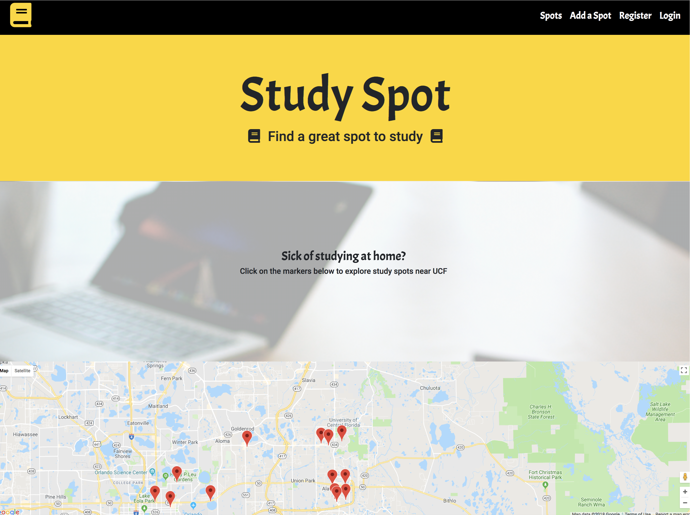

# Study Spot

Study Spot is a MERN application created for students who are looking for places to study. I developed this app after I organized the study group sessions for my web development bootcamp. Websites such as Yelp and Google did not provide sufficient information regarding outlets, wifi, noise level, and other factors I considered conducive to a successful study outing. The great thing about Study Spot is if a spot you know of doesn't exist on the site, you can just add it yourself. 

Study Spot is a user-friendly, free to use application with a polished UI. 

https://study-spot-ucf.herokuapp.com/

If you do test out the application, please use it with respect.

## Study Spot's Pages

* Landing 

 

* Spots

 

* Add Spots

 

## Technologies Used
* Mongo DB with Mongoose
* Express JS 
* React JS 
* Node JS 
* Google-React-Maps
* Yelp API
* Heroku

## Future Development

* Users will be able to save their favorite spots.
* All users will be able to vote on spots to affect their overall rating.
* User comments will display when looking for spots. Comments can be voted on and displayed based on the number of upvotes the comment has.
* Implement Node-mailer to send out updates to registered users.
* When a pin is clicked on the Spots page, send the user to the Google Maps website so they can get directions to the spot. 

